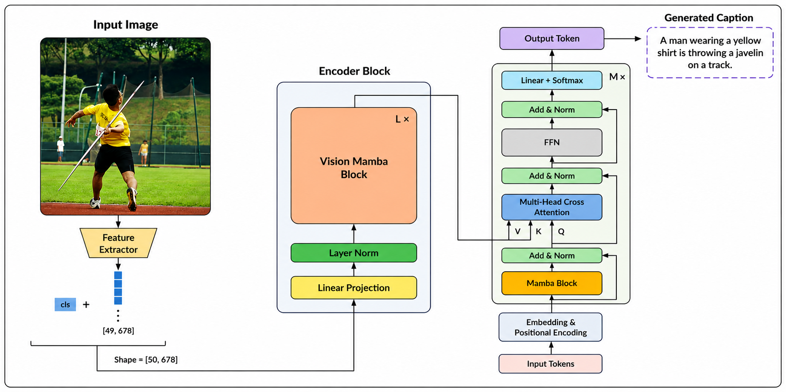

# HMT: Hybrid Mamba–Transformer for Image Captioning

<p align="center">

Official PyTorch implementation of **HMT**, a hybrid Vision Mamba–Transformer architecture for efficient image captioning.

**Authors:** Mohammad Abdian, Sayeh Mirzaei

</p>

---

## ✨ Highlights

- 🚀 Hybrid Vision Mamba–Transformer architecture
- 🔄 Cross-shaped 2D spatial scanning
- 🧠 Gated fusion of CLIP and Vision Mamba features
- ⚡ Causal Mamba decoder with Transformer cross-attention
- 📉 Only **7.3 GFLOPs**
- 🎯 Competitive performance on **MS COCO** and **Flickr30k**

---

## 🏗️ Architecture

<p align="center">

</p>

### Encoder
- Frozen CLIP ViT-B/32
- Vision Mamba
- Horizontal & Vertical Scan
- Gated Feature Fusion

### Decoder
- Causal Mamba
- Cross-Attention
- Linear-time sequence modeling

---

## 📊 Model Statistics

| Item | Value |
|------|------:|
| Backbone | CLIP ViT-B/32 |
| Total Parameters | **138.6M** |
| Trainable Parameters | **50.8M** |
| Frozen Parameters | **87.8M** |
| FLOPs | **7.3G** |

---

## 📈 Results

#### MS COCO (Karpathy Test Split)

| B@1 | B@4 | METEOR | ROUGE-L | CIDEr | SPICE |
|:---:|:---:|:-------:|:--------:|:------:|:------:|
| **78.2** | **38.4** | **28.7** | **58.8** | **122.5** | **22.7** |

### Flickr30k (Karpathy Test Split)

| B@1 | B@2 | B@3 | B@4 | METEOR | ROUGE-L | CIDEr | SPICE |
|:---:|:---:|:---:|:---:|:-------:|:--------:|:------:|:------:|
| **68.3** | **52.4** | **39.4** | **29.3** | **25.6** | **50.1** | **63.8** | **16.6** |
---


## ⚙️ Training

| Item | Value |
|------|------:|
| GPU | RTX 4090 (24GB) |
| Optimizer | AdamW |
| Batch Size | 32 |
| Epochs | 8 |
| Learning Rate | 1e-4 |
| Scheduler | Cosine Annealing |
| Beam Size | 3 |

Training Time

| Dataset | Time |
|---------|------|
| MS COCO | 10.1 h |
| Flickr30k | 2.3 h |

---

## 📂 Datasets

Experiments follow the standard **Karpathy split**.

| Dataset | Train | Val | Test |
|---------|------:|----:|-----:|
| MS COCO | 113,287 | 5,000 | 5,000 |
| Flickr30k | 29,783 | 1,000 | 1,000 |

---

## 📏 Evaluation Metrics

- BLEU-1 / BLEU-2 / BLEU-3 / BLEU-4
- METEOR
- ROUGE-L
- CIDEr
- SPICE

---

## 🚀 Quick Start

```bash
# Feature extraction
python -m feature_pipeline/run

# Training & Evaluation
python -m train/main


## 📄 Paper

The manuscript is currently under review.

---

## 💻 Code Availability

The complete implementation is available at:

**https://github.com/mohammadabdian/HMT**

---

## 📚 Citation

```bibtex
@article{abdian2026hmt,
  title={HMT: A Hybrid Mamba--Transformer Architecture for Image Captioning},
  author={Mohammad Abdian, Sayeh Mirzaei},
  journal={Under Review},
  year={2026}
}
```

---

## 📜 License

Released for academic research purposes.
